# ZCM PoC User Guide from AWS to OCI 

---
## Prerequisites

1. The user data is script for automatically installing ZCM source and target agent on VMs. You can download userdata files from [here](https://www.zconverter.com/zm/scripts/).
    - Userdata for AWS source VM: `aws-source-cent.sh` or `aws-source-ubuntu.sh` 
    - Userdata for OCI target VM: `oci-target-cent.sh` or `oci-target-ubuntu.sh`

2. Prepare API Keys for OCI CLI login. Refer to [How to
Generate an API Signing Key](https://docs.oracle.com/en-us/iaas/Content/API/Concepts/apisigningkey.htm) for details.


### Prerequisites for AWS

1. **Authorizing for CLI**
    
    To authorize AWS CLI, you need Access key, Secret Access key. For more information, see: [**Managing Access Keys for IAM Users**](https://docs.aws.amazon.com/ko_kr/IAM/latest/UserGuide/id_credentials_access-keys.html#access-keys_required-permissions)
    
    1. Go to **IAM > User** page in the AWS console. 
    2. Choose an existing user or create a new one.  
        
         

        
    3. Go to **Security Credentials** menu.
    4.  Click `Create access key`.
        
         
        

1. **SSH Key file**
    
    If you want to connect VMs using third party tools or OpenSSH, you need a SSH key pair. For more information, see: [**Create EC2 SSH Key pair**](https://docs.aws.amazon.com/ground-station/latest/ug/create-ec2-ssh-key-pair.html)
    
    1. Go to **EC2 > Network&Security > Key Pairs** page in AWS console 
    2. Create new SSH key pair:
        1. Click `Create Key pair`
        2. Specify the following:
            - **Key pair type:** RSA
            - **Private key file format**: ****.pem
        3. Click `Create key pair`. The private key file (.pem) will be downloaded to your local system.
            
             
            
    3. **(optional)** Create a private key file to connect Linux VMs by using **PuTTYGen**
        1. Open **PuTTYGen**.
        2. Click `Import key` under **Conversion** menu. Import the private key file (.pem) created in the previous step. 
            
             
            
        3. Click `Save private key` to save PPK key file. The private key file (.ppk) will be downloaded to your local system.
            
             
            

1. **Security Group for ZCM**
    
    For ZCM migration, you need to prepare a Security Group. 
    
    If you select `Automatically create a new security group` when add VM Info from ZConverter console, the security group is automatically created with the following rules:
    
    ```bash
    [
        {
            "protocol": "tcp",
            "from": 22,
            "to": 22,
            "source": "218.145.116.162/32"
        },
        {
            "protocol": "tcp",
            "from": 3389,
            "to": 3389,
            "source": "218.145.116.162/32"
        },
        {
            "protocol": "tcp",
            "from": 3306,
            "to": 3306,
            "source": "218.145.116.162/32"
        },
        {
            "protocol": "tcp",
            "from": 80,
            "to": 80,
            "source": "0.0.0.0/0"
        },
        {
            "protocol": "tcp",
            "from": 111,
            "to": 111,
            "source": "0.0.0.0/0"
        },
        {
            "protocol": "tcp",
            "from": 139,
            "to": 139,
            "source": "0.0.0.0/0"
        },
        {
            "protocol": "tcp",
            "from": 443,
            "to": 445,
            "source": "0.0.0.0/0"
        },
        {
            "protocol": "tcp",
            "from": 2049,
            "to": 2049,
            "source": "0.0.0.0/0"
        },
        {
            "protocol": "tcp",
            "from": 3000,
            "to": 3000,
            "source": "0.0.0.0/0"
        },
        {
            "protocol": "tcp",
            "from": 4001,
            "to": 4001,
            "source": "0.0.0.0/0"
        },
        {
            "protocol": "tcp",
            "from": 5001,
            "to": 5005,
            "source": "0.0.0.0/0"
        },
        {
            "protocol": "tcp",
            "from": 9051,
            "to": 9054,
            "source": "0.0.0.0/0"
        },
        {
            "protocol": "tcp",
            "from": 50000,
            "to": 50005,
            "source": "0.0.0.0/0"
        },
        {
            "protocol": "tcp",
            "from": 53306,
            "to": 53306,
            "source": "0.0.0.0/0"
        },
        {
            "protocol": "icmp",
            "from": -1,
            "to": -1,
            "source": "0.0.0.0/0"
        }
    ]
    ```
    
### Prerequisites for OCI

1. **Authorizing for CLI**
    
    To authorize Oracle Cloud CLI, you need an API key pair. For more information, see: [**How to Generate an API Signing Key**](https://docs.oracle.com/en-us/iaas/Content/API/Concepts/apisigningkey.htm)
    
    1. Go to **Identity & Security > User** page in Oracle Cloud console**.** 
    2. Choose an existing user or ****create a new one.  ****
    3. Go to **API Keys** page.
        
         
        
    4. Click **`Add API Key`** to create a new key pair. 
        
         
        
    5. After creating, click `Download Private Key`. The private key (.pem) will be downloaded to your local system.  
    6. Click `Add`.
    7. Copy the text from the **Configuration File Preview** field. Then, save the copied value in your configuration file. 
        
         
        
    
2. **SSH Key file**
    
    If you want to connect VMs using third party tools or OpenSSH, you need a SSH key pair.
    
    1. Open **PuTTYGen**. 
    2. Specify **Parameter** field**:** 
        - **Type of key to generate**: RSA
        - **Number of bits in a generated key**: `2048` or more
    3. Click `Generate`.
    4. Copy the text from the **Public key for pasting into OpenSSH authorized_keys file** field. Then, save the copied value as Public key file (.pub).

1. **Subnet for ZCM** 
    
    For ZCM migration, you need to prepare a Subnet.
    
    If you select `Automatically create a new subnet` when add VM Info from ZConverter console, the subnet is automatically created with the follwoing rules:  
    
    ```bash
    IN_RULE = [
      {
        "icmpOptions": {
          "code": 4,
          "type": 3
        },
        "isStateless": False,
        "protocol": "1",
        "source": "0.0.0.0/0"
      },
      {
        "icmpOptions": {
          "type": 3
        },
        "isStateless": False,
        "protocol": "1",
        "source": "10.0.0.0/16"
      },
      {
        "source": "218.145.116.162/32",
        "protocol": "6",
        "isStateless": True,
        "tcpOptions": {
          "destinationPortRange": {
            "max": 22,
            "min": 22
          }
        }
      },
      {
        "source": "218.145.116.162/32",
        "protocol": "6",
        "isStateless": True,
        "tcpOptions": {
          "destinationPortRange": {
            "max": 3389,
            "min": 3389
          }
        }
      },
      {
        "source": "218.145.116.162/32",
        "protocol": "6",
        "isStateless": True,
        "tcpOptions": {
          "destinationPortRange": {
            "max": 3306,
            "min": 3306
          }
        }
      },
      {
        "source": "0.0.0.0/0",
        "protocol": "6",
        "isStateless": True,
        "tcpOptions": {
          "destinationPortRange": {
            "max": 9054,
            "min": 9051
          }
        }
      },
      {
        "source": "0.0.0.0/0",
        "protocol": "17",
        "isStateless": True,
        "udpOptions": {
          "destinationPortRange": {
            "max": 9054,
            "min": 9051
          }
        }
      },
      {
        "source": "0.0.0.0/0",
        "protocol": "6",
        "isStateless": True,
        "tcpOptions": {
          "destinationPortRange": {
            "max": 50005,
            "min": 50000
          }
        }
      },
      {
        "source": "0.0.0.0/0",
        "protocol": "6",
        "isStateless": True,
        "tcpOptions": {
          "destinationPortRange": {
            "max": 80,
            "min": 80
          }
        }
      },
      {
        "source": "0.0.0.0/0",
        "protocol": "6",
        "isStateless": True,
        "tcpOptions": {
          "destinationPortRange": {
            "max": 53306,
            "min": 53306
          }
        }
      },
      {
        "source": "0.0.0.0/0",
        "protocol": "6",
        "isStateless": True,
        "tcpOptions": {
          "destinationPortRange": {
            "max": 139,
            "min": 139
          }
        }
      },
      {
        "source": "0.0.0.0/0",
        "protocol": "6",
        "isStateless": True,
        "tcpOptions": {
          "destinationPortRange": {
            "max": 445,
            "min": 443
          }
        }
      },
      {
        "source": "0.0.0.0/0",
        "protocol": "6",
        "isStateless": True,
        "tcpOptions": {
          "destinationPortRange": {
            "max": 111,
            "min": 111
          }
        }
      },
      {
        "source": "0.0.0.0/0",
        "protocol": "6",
        "isStateless": True,
        "tcpOptions": {
          "destinationPortRange": {
            "max": 2049,
            "min": 2049
          }
        }
      },
      {
        "source": "0.0.0.0/0",
        "protocol": "6",
        "isStateless": True,
        "tcpOptions": {
          "destinationPortRange": {
            "max": 4001,
            "min": 4001
          }
        }
      },
      {
        "source": "0.0.0.0/0",
        "protocol": "6",
        "isStateless": True,
        "tcpOptions": {
          "destinationPortRange": {
            "max": 5005,
            "min": 5000
          }
        }
      },
      {
        "source": "0.0.0.0/0",
        "protocol": "6",
        "isStateless": True,
        "tcpOptions": {
          "destinationPortRange": {
            "max": 3000,
            "min": 3000
          }
        }
      }
    ]
    
    EG_RULE = [
        {
            "destination": "0.0.0.0/0",
            "protocol": "all",
            "isStateless": False
        }
    ]
    ```

---


## Install ZCM_WEB VM 
1. Download `zcm_api_install.sh` from the following [link](https://www.zconverter.com/zm/zcm_api_install.sh).

2. Install ZCM_WEB Instances following the steps on this [github link](https://github.com/ZConverter-samples/terraform-oci-ansible-userdata).

    #### [ Requirements for ZCM_WEB VM ]
    &nbsp;Edit `./oci-ansible-server.oci_terraform_ansible_server.json` as listed below* 
    
    (*plain text : follow the instructions, "" : write as it is, [] : name of a file/folder)
    ```
    provider : value of [OCI API key] that was created on the previous step  
    vm_name : "ZCM_WEB”
    subnet_ocid : value of the ocid of the Subnet of ZCM WEB Server Instance @ Oracle Cloud Console
    user_data_file_path : After moving [ZCM_install_script.sh] file to [./terraform-oci-ansible-userdata/oci-ansible-server/] folder, Write this value as "./ZCM_install_script.sh"
    create_security_group_rules : Copy and paste the [security_rule.json] under `docs,files` folder
    ```

3. Wait 10~20 minutes for the instance to operate.
4. Access the installed instance's public IP with port 4001.


---

## Install Source and Target VM
You should **ADD** VM information first, and then **GEN**ERATE VM.

1) Choose `AWS` menu.
2) Click `ADD` and register informatino of the source VM.

    <details>
    <summary> Example for AWS Source VM </summary>
    <div markdown="1">

    - **Profile**

        Use default value

    - **Access Key & Secret Access Key & Login Region**

        Use default value

        ```
        You can use your access key and secret access key created in AWS console. 
        ```

    - **Region**

        Use default value

    - **OS & OS_version**

        Select **CentOS , 7**

        ```
        Select OS and OS_version for VM.
        ```

    - **VM Name**

        ```bash
        Specify the name of VM.
        ```

    - **Image**

        Select ****ami-09e2a570cb404b37e (CentOS-7-2111-20220825_1.x86_64-d9a3032a-921c-4c6d-b150-bde168105e42)****

        ```bash
        Select an AMI image on the toggle list for VM.
        If you select the AMI of AWS marketplace, you must subscribe to the image in AWS console before using it. 
        ```

    - **Instance Type**

        Use default value

        ```
        Select a Instance type for VM.
        ```

    - **CPU Count & Memory Size**

        Use default value

        ```
        Select CPU Count for VM.
        ```

    - **Security Group Id**

        After deselect `Automatically create a new security group` option, select **sg-073eb02b16e13cb17 (zcon-demo)**

        ```
        If you select the "Automatically create a new security group" option, You can create a new security group for ZCM migration.
        For more information, see "Prerequisites and VM Info by Cloud platform - AWS" section. 
        ```

    - ****Login Key [ .pem ]****

        Upload **aws_demo_key.pem** file

        ```
        You can use a public SSH key of your key pair imported in AWS console. 
        ```

    - **Volume**

        Use default value

        ```bash
        If you want to attach one or more additional disks to the VM, list sizes with comma(,).
        ```

    - **User data** ****[ .sh / .ps1 ]****

        Upload **aws-source-userdata.sh** file
    </div>
    </details>

3) Choose 'OCI' menu.
4) Click `ADD` and register information for the target VM.

    <details>
    <summary> Example for OCI target VM </summary>
    <div markdown="1">

    - **Credentials File Upload [ Config File ]**

        Upload **oci_config** file 

    - **Config Key File [ .pem ]**

        Upload **oci_config.pem** file 

        ```bash
        You can use your config and config key file (.pem) created in Oracle Cloud console.
        ```

    - **Compartment Id**

        Use default value

    - **Available Domain**

        Use default value

    - **VM Name**

        ```bash
        Specify the name of VM.
        ```

    - **Profile**

        Insert the profile in your config file  

        ```bash
        Example of Config file)
        [DEFAULT] // ← profile
        user=*****************
        fingerprint=*****************
        tenancy=*****************
        region=*****************
        key_file=*****************
        ```

    - **Machine Type [ Shape ]**

        Use default value

        ```
        Select a Machine type for VM.
        ```

    - **CPU Count & Memory Size**

        Use default value

        ```
        Specify CPU Count and Memory Size for VM.
        ```

    - **OS & OS_version**

        Select **CentOS , 7** 

        ```
        Select OS and OS_version for VM.
        ```

    - **Subnet ID**

        After deselect `Automatically create a new subnet` , select **subnet-20210421-1418 (ocid1.subnet.oc1.ap-seoul-1.aaaaaaaaikxwifqksivdvnvl27k6mffo7cnvqv4xhw4rvcgjnc7yc7ydkc2q)**

        ```
        If you select the "Automatically create a new subnet" option, You can create a new subnet for ZCM migration.
        For more informatino, see "Prerequisites and VM Info by Cloud platform - OCI" section. 
        ```

    - **Volume**

        Insert **50**

        ```bash
        If you want to attach one or more additional disks to the VM, list sizes with comma(,).
        Target VM need at least an pesistent disk. The disk size must be at least 50GB
        ```

    - **Login Key [ .pub ]**

        Upload **oci_gcp_demo_key.pub** file

        ```bash
        You can use a public key of your SSH key pair. The key must use the RSA format
        ```

    - **User data [ .sh / .ps1 ]**

        Upload **oci-target-userdata.sh** file
    </div>
    </details>

5) Select the VM informations to be installed and click `Gen` to create.  


## ZConverter Migration demonstration
After installing Source and Target VM installation and agent installation, access the `ZConverter Migration management portal` to proceed with the migration. 

1. Access [https://www.z-cloud.net/](https://www.z-cloud.net/) with a web browser and log in with an administrator account.
    
    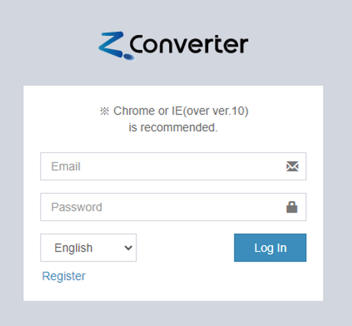

2. Move to the platform tab you want to migrate among the "Cloud Migration" tabs. 
    (Ex: in case of AWS -> OCI migration, move to OCI tab)

    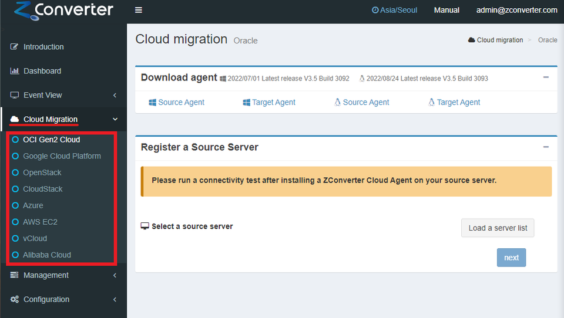

3. Install agent 
**IF source agent/target agent is installed already via user data, skip to step 4.**
    ### Source Agent
    - Download the Source Agent installation file corresponding to the source server's OS (Windows or Linux) from the "Download Agent" panel.

        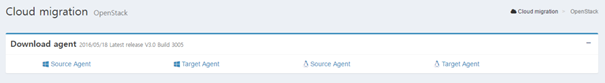
    
    - Windows : 
        - Remote access to the source server and copy the downloaded agent file to the Source source server    
            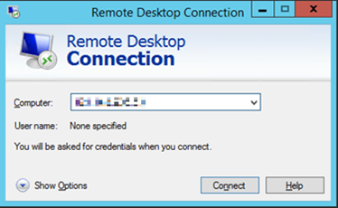
        
        - After running the installation file, select the installation language and click OK
            
            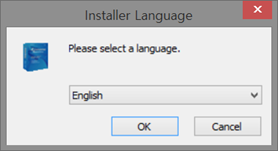
        - Click "Next"

            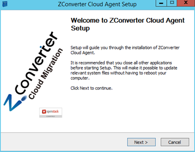
        - Click "I Agree"

            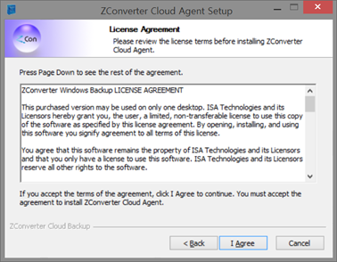
        - Click "Install"

            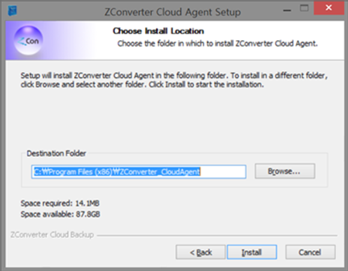

        - When the settings window appears, enter or select the following information.
            - Connect option : Choose "Public ZConverter SaaS(http://www.z-cloud.net)"
            - Agent mode : "Source"
            - User Information : Enter the account information you are currently accessing.

                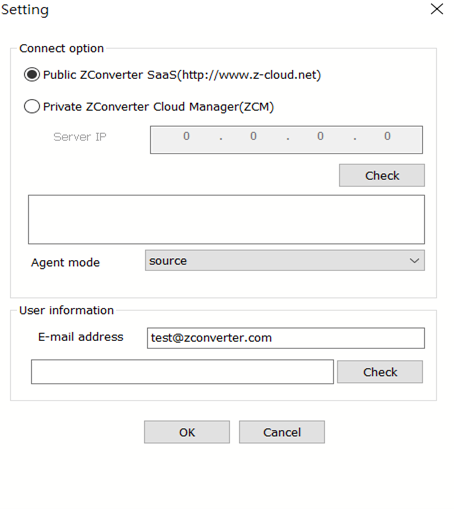

    - Linux Server :
        - SSH access to the source server, and copy the downloaded agent installation file to the /tmp directory of the source server.
        - Proceed with the installation through the following command.

            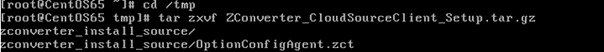
            
            ```
            cd /tmp
            tar zxvf ZConverter_CloudSourceClient_Setup_RedHat_x86_V3.0_Build_3005.tar.gz
            cd zconverter_install_source
            ```

        - ./install.sh command to proceed with the installation.
        - This is where the agent is to be installed. If you want to install it on a different path, enter that path. The default installation route is /ZConverteragent.

            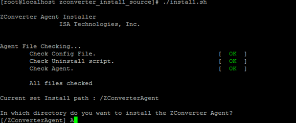
            
        - This is the type selection of ZConverter Cloud Migration. If you use Public ZCM, choose Item 1, and if you use Private ZCM, select Item 2 and enter the IP of that ZCM.

            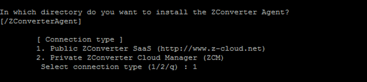

        - This is the part where you enter the account of ZCM that you are currently using.

            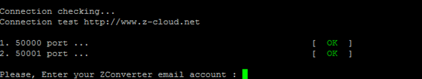

        - When the installation is completed as shown in the following screen, close the connection with the server and return to the z-cloud.net web portal.

            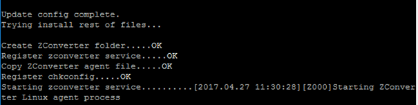

            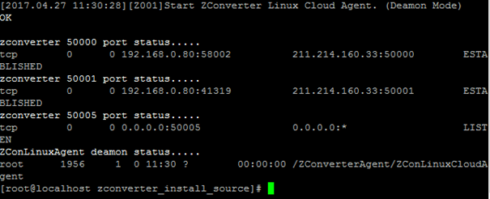

    - Register a source server
        - Click the `Load a server list` button to bring the server where the source agent is installed to the list.

            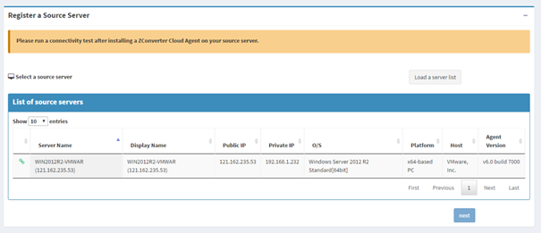

        - Please check the connection status between the source server's agent and the ZConverter Cloud Management server through the leftmost icon in the server list. If the connection is disconnected, it is displayed as a red icon, and if the migration proceeds to this state, it may cause an error.

            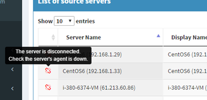

       - Click on the server to migrate, and select a source server imaging method in the "Create or select a source image" panel.
            - "Create a new image" option: Select if you create and migrate a new image of the server.
            - "Use an listing image" option: Select if you are migrating an existing server image.
            
                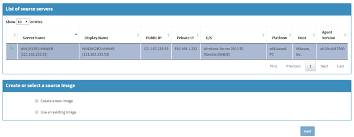

            - Check the disk to be migrated.
            - In the "Option" panel, select the type and path of the source image storage. (The source image storage is used to store the image of the source server.)
                - "Basic" type: Local type storage that is created within the source server and stores images.
                    - We recommend creating a repository on a disk other than the disk to be migrated (when migrating Windows) or creating a repository in the root directory (when migrating Linux).
                - "Advanced" type: Storage on a remote server. You can select a storage or other network storage within the target server.
                    - Select the `Target Repository` menu if you want to create a repository within the target server to store the source image.
            - Click `next`.

                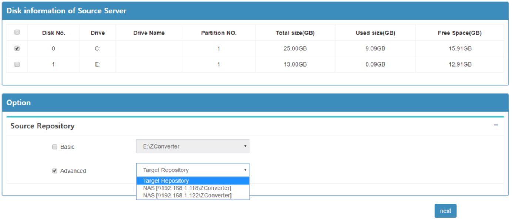

    ### Target Agent
    - Download the Target Agent installation file corresponding to the target server's OS (Windows or Linux) from the "Download Agent" panel at the top of the page.

        
    - Windows
        - The target agent installation procedure is the same as for source agent installation.
        - After remote access to the target instance, copy the downloaded agent installation file to the target instance. The subsequent installation procedure proceeds the same as the second process of "How to use ZConverter Cloud Migration."
    - Linux Server
        - SSH access to the target server and copy the downloaded agent installation file to the /tmp directory of the target server.
        - Proceed with the installation through the following command.

            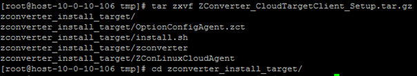

            ```
            cd /tmp
            tar zxvf ZConverter\_CloudTargetClient\_Setup\_RedHat\_x86\_V3.0\_Build\_3005.tar.gz
            #(The file name may be different. Please enter the exact file name of the downloaded agent installation file.)
            cd zconverter\_install\_target
            ```
        - Enter the ./install.sh command to proceed with the installation.
        - This is where the agent is to be installed. If you want to install it on a different path, enter that path. The default installation route is /ZConverteragent.
        
            
        - This is the type selection of ZConverter Cloud Migration. If you use Public ZCM, choose Item 1, and if you use Private ZCM, select Item 2 and enter the IP of that ZCM.
        
            

        - This is the part where you enter the account of ZCM that you are currently using.

            

        - When the installation is complete as shown in the following screen, close the connection with the server and return to the z-cloud.net web portal.

            

            

        - Register a target server
            - Click the `Load a server list` button to bring the server where the target agent is installed to the list.

                

            - Please check the connection status between the target server's agent and the ZConverter Cloud Management server through the leftmost icon in the server list. If the connection is disconnected, it is displayed as a red icon, and if the migration proceeds to this state, it may cause an error.

                
                
            - Click the migration target server in the target server list to retrieve disk information.
            - Map the migration target disk of the source server to the "Mapping to the source server" item of the same disk drive as the migration target disk of the source server.

                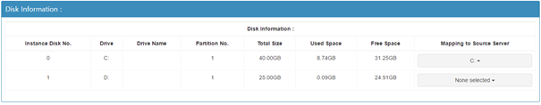
            - In the "Target Repository" panel, select the type and path of the image repository.
                - "Basic" Type : Select this option when the source image repository is set to the "Basic" type or "Advanced" type "Target Repository" menu.
                    - ※ The target repository must be created on a drive other than the drive mapped to the source server (Windows migration), or on the /ZConverter/ZConverter path (Linux migration).
                - "Advanced" type: Select this option if the source image store is set to "Advanced" type of network store (please select the same network store selected as the source image store).    

                    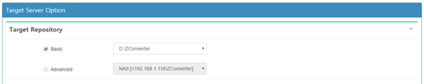       
            
            - In the "Replication Option" panel, set the target server IP and port to which the source image is to be transmitted.
                - Target IP : Select the authorized IP of the target server (if not on the list, please press the "Add IP" button to add it).
                - Replication Port : Sets the port number to connect when sending the image (default: 50005).
            - Set other migration options in the "Other Option" panel.
                - Hypervisor : Select the virtual device driver type for the cloud instance.
                - Kernel update : Check if you want to update the kernel version of the server. (When you migrate Linux)
                - Encryption (AES256) : Select if you want to apply data encryption during migration.
                - After job script : Register the script file to be executed after migration is completed. (Only .cmd or .sh files can be registered.)
            - Click `next`.

                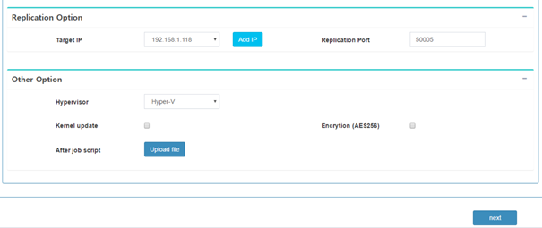       
            
            - Press the `OK` button to start the migration.

                 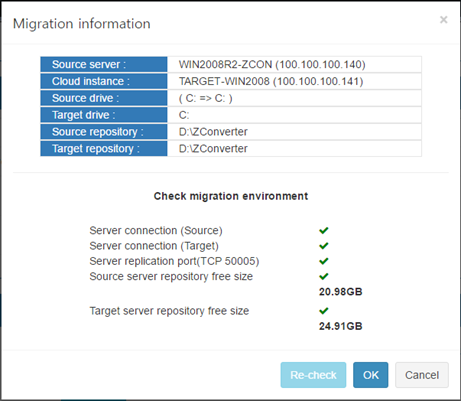 

            - When the migration operation starts, it automatically goes to the "Monitoring Job" page.

                 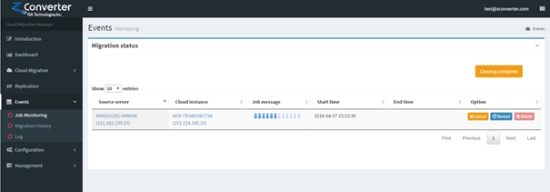 
