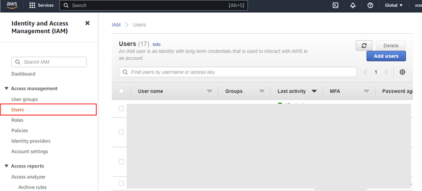
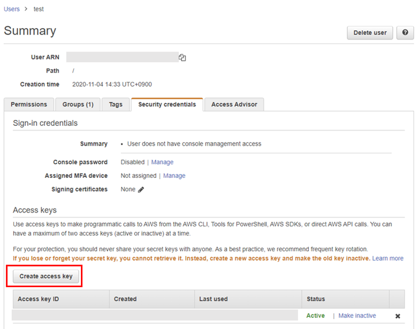
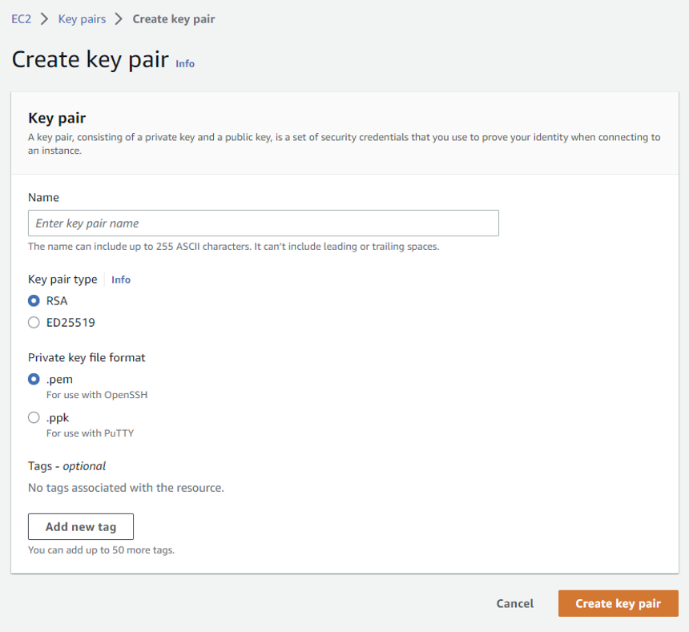
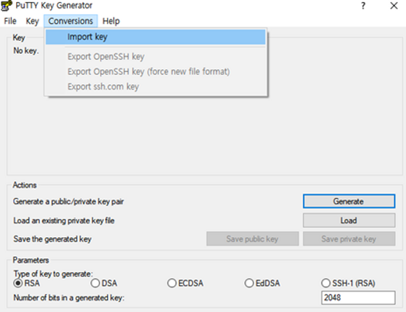
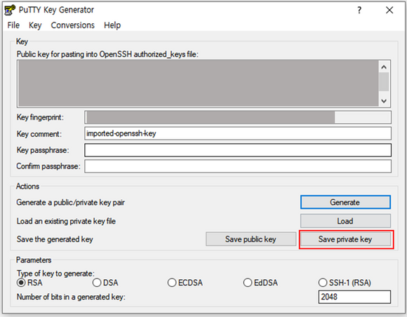
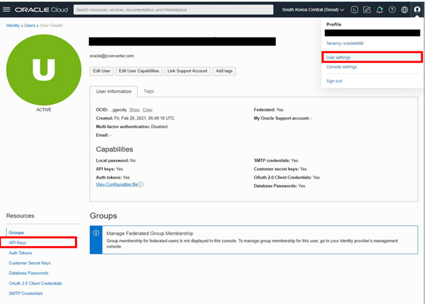
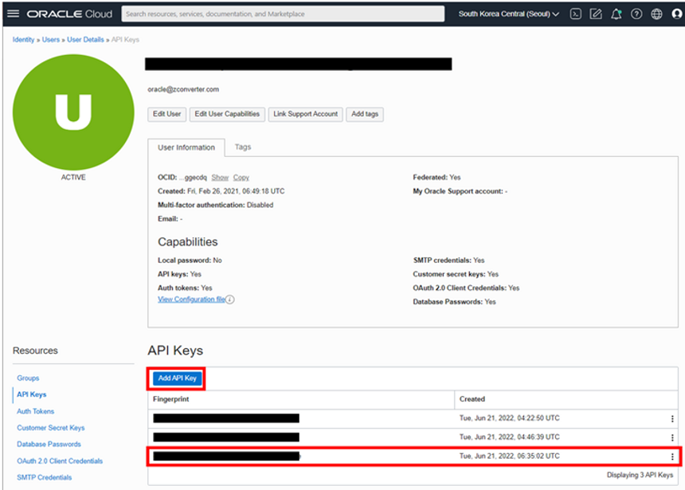
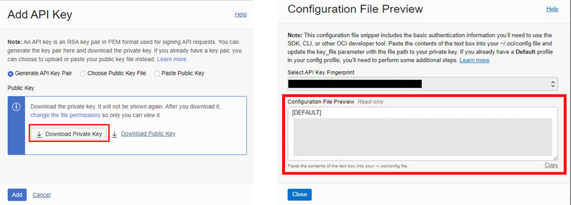

# Prerequisites for Migration from AWS to OCI 

---

## Userdata for ZCM Source and Target

The user data is script for automatically installing ZCM source and target agent on VMs. You can download userdata files from [here](https://www.zconverter.com/zm/scripts/).

- Userdata for AWS source VM: `aws-source-cent.sh` or `aws-source-ubuntu.sh` 
- Userdata for OCI target VM: `oci-target-cent.sh` or `oci-target-ubuntu.sh`


## Prerequisites

### AWS

1. **Authorizing for CLI**
    
    To authorize AWS CLI, you need Access key, Secret Access key. For more information, see: [**Managing Access Keys for IAM Users**](https://docs.aws.amazon.com/ko_kr/IAM/latest/UserGuide/id_credentials_access-keys.html#access-keys_required-permissions)
    
    1. Go to **IAM > User** page in the AWS console. 
    2. Choose an existing user or create a new one.  
        
         

        
    3. Go to **Security Credentials** menu.
    4.  Click `Create access key`.
        
         
        

1. **SSH Key file**
    
    If you want to connect VMs using third party tools or OpenSSH, you need a SSH key pair. For more information, see: [**Create EC2 SSH Key pair**](https://docs.aws.amazon.com/ground-station/latest/ug/create-ec2-ssh-key-pair.html)
    
    1. Go to **EC2 > Network&Security > Key Pairs** page in AWS console 
    2. Create new SSH key pair:
        1. Click `Create Key pair`
        2. Specify the following:
            - **Key pair type:** RSA
            - **Private key file format**: ****.pem
        3. Click `Create key pair`. The private key file (.pem) will be downloaded to your local system.
            
             
            
    3. **(optional)** Create a private key file to connect Linux VMs by using **PuTTYGen**
        1. Open **PuTTYGen**.
        2. Click `Import key` under **Conversion** menu. Import the private key file (.pem) created in the previous step. 
            
             
            
        3. Click `Save private key` to save PPK key file. The private key file (.ppk) will be downloaded to your local system.
            
             
            

1. **Security Group for ZCM**
    
    For ZCM migration, you need to prepare a Security Group. 
    
    If you select `Automatically create a new security group` when add VM Info from ZConverter console, the security group is automatically created with the following rules:
    
    ```bash
    [
        {
            "protocol": "tcp",
            "from": 22,
            "to": 22,
            "source": "218.145.116.162/32"
        },
        {
            "protocol": "tcp",
            "from": 3389,
            "to": 3389,
            "source": "218.145.116.162/32"
        },
        {
            "protocol": "tcp",
            "from": 3306,
            "to": 3306,
            "source": "218.145.116.162/32"
        },
        {
            "protocol": "tcp",
            "from": 80,
            "to": 80,
            "source": "0.0.0.0/0"
        },
        {
            "protocol": "tcp",
            "from": 111,
            "to": 111,
            "source": "0.0.0.0/0"
        },
        {
            "protocol": "tcp",
            "from": 139,
            "to": 139,
            "source": "0.0.0.0/0"
        },
        {
            "protocol": "tcp",
            "from": 443,
            "to": 445,
            "source": "0.0.0.0/0"
        },
        {
            "protocol": "tcp",
            "from": 2049,
            "to": 2049,
            "source": "0.0.0.0/0"
        },
        {
            "protocol": "tcp",
            "from": 3000,
            "to": 3000,
            "source": "0.0.0.0/0"
        },
        {
            "protocol": "tcp",
            "from": 4001,
            "to": 4001,
            "source": "0.0.0.0/0"
        },
        {
            "protocol": "tcp",
            "from": 5001,
            "to": 5005,
            "source": "0.0.0.0/0"
        },
        {
            "protocol": "tcp",
            "from": 9051,
            "to": 9054,
            "source": "0.0.0.0/0"
        },
        {
            "protocol": "tcp",
            "from": 50000,
            "to": 50005,
            "source": "0.0.0.0/0"
        },
        {
            "protocol": "tcp",
            "from": 53306,
            "to": 53306,
            "source": "0.0.0.0/0"
        },
        {
            "protocol": "icmp",
            "from": -1,
            "to": -1,
            "source": "0.0.0.0/0"
        }
    ]
    ```
    
### OCI

1. **Authorizing for CLI**
    
    To authorize Oracle Cloud CLI, you need an API key pair. For more information, see: [**How to Generate an API Signing Key**](https://docs.oracle.com/en-us/iaas/Content/API/Concepts/apisigningkey.htm)
    
    1. Go to **Identity & Security > User** page in Oracle Cloud console**.** 
    2. Choose an existing user or ****create a new one.  ****
    3. Go to **API Keys** page.
        
         
        
    4. Click **`Add API Key`** to create a new key pair. 
        
         
        
    5. After creating, click `Download Private Key`. The private key (.pem) will be downloaded to your local system.  
    6. Click `Add`.
    7. Copy the text from the **Configuration File Preview** field. Then, save the copied value in your configuration file. 
        
         
        
    
2. **SSH Key file**
    
    If you want to connect VMs using third party tools or OpenSSH, you need a SSH key pair.
    
    1. Open **PuTTYGen**. 
    2. Specify **Parameter** field**:** 
        - **Type of key to generate**: RSA
        - **Number of bits in a generated key**: `2048` or more
    3. Click `Generate`.
    4. Copy the text from the **Public key for pasting into OpenSSH authorized_keys file** field. Then, save the copied value as Public key file (.pub).

1. **Subnet for ZCM** 
    
    For ZCM migration, you need to prepare a Subnet.
    
    If you select `Automatically create a new subnet` when add VM Info from ZConverter console, the subnet is automatically created with the follwoing rules:  
    
    ```bash
    IN_RULE = [
      {
        "icmpOptions": {
          "code": 4,
          "type": 3
        },
        "isStateless": False,
        "protocol": "1",
        "source": "0.0.0.0/0"
      },
      {
        "icmpOptions": {
          "type": 3
        },
        "isStateless": False,
        "protocol": "1",
        "source": "10.0.0.0/16"
      },
      {
        "source": "218.145.116.162/32",
        "protocol": "6",
        "isStateless": True,
        "tcpOptions": {
          "destinationPortRange": {
            "max": 22,
            "min": 22
          }
        }
      },
      {
        "source": "218.145.116.162/32",
        "protocol": "6",
        "isStateless": True,
        "tcpOptions": {
          "destinationPortRange": {
            "max": 3389,
            "min": 3389
          }
        }
      },
      {
        "source": "218.145.116.162/32",
        "protocol": "6",
        "isStateless": True,
        "tcpOptions": {
          "destinationPortRange": {
            "max": 3306,
            "min": 3306
          }
        }
      },
      {
        "source": "0.0.0.0/0",
        "protocol": "6",
        "isStateless": True,
        "tcpOptions": {
          "destinationPortRange": {
            "max": 9054,
            "min": 9051
          }
        }
      },
      {
        "source": "0.0.0.0/0",
        "protocol": "17",
        "isStateless": True,
        "udpOptions": {
          "destinationPortRange": {
            "max": 9054,
            "min": 9051
          }
        }
      },
      {
        "source": "0.0.0.0/0",
        "protocol": "6",
        "isStateless": True,
        "tcpOptions": {
          "destinationPortRange": {
            "max": 50005,
            "min": 50000
          }
        }
      },
      {
        "source": "0.0.0.0/0",
        "protocol": "6",
        "isStateless": True,
        "tcpOptions": {
          "destinationPortRange": {
            "max": 80,
            "min": 80
          }
        }
      },
      {
        "source": "0.0.0.0/0",
        "protocol": "6",
        "isStateless": True,
        "tcpOptions": {
          "destinationPortRange": {
            "max": 53306,
            "min": 53306
          }
        }
      },
      {
        "source": "0.0.0.0/0",
        "protocol": "6",
        "isStateless": True,
        "tcpOptions": {
          "destinationPortRange": {
            "max": 139,
            "min": 139
          }
        }
      },
      {
        "source": "0.0.0.0/0",
        "protocol": "6",
        "isStateless": True,
        "tcpOptions": {
          "destinationPortRange": {
            "max": 445,
            "min": 443
          }
        }
      },
      {
        "source": "0.0.0.0/0",
        "protocol": "6",
        "isStateless": True,
        "tcpOptions": {
          "destinationPortRange": {
            "max": 111,
            "min": 111
          }
        }
      },
      {
        "source": "0.0.0.0/0",
        "protocol": "6",
        "isStateless": True,
        "tcpOptions": {
          "destinationPortRange": {
            "max": 2049,
            "min": 2049
          }
        }
      },
      {
        "source": "0.0.0.0/0",
        "protocol": "6",
        "isStateless": True,
        "tcpOptions": {
          "destinationPortRange": {
            "max": 4001,
            "min": 4001
          }
        }
      },
      {
        "source": "0.0.0.0/0",
        "protocol": "6",
        "isStateless": True,
        "tcpOptions": {
          "destinationPortRange": {
            "max": 5005,
            "min": 5000
          }
        }
      },
      {
        "source": "0.0.0.0/0",
        "protocol": "6",
        "isStateless": True,
        "tcpOptions": {
          "destinationPortRange": {
            "max": 3000,
            "min": 3000
          }
        }
      }
    ]
    
    EG_RULE = [
        {
            "destination": "0.0.0.0/0",
            "protocol": "all",
            "isStateless": False
        }
    ]
    ```

---

## Add Source and Target VM Info

### AWS Source VM

- **Profile**
    
    Use default value
    
- **Access Key & Secret Access Key & Login Region**
    
    Use default value
    
    ```
    You can use your access key and secret access key created in AWS console. 
    ```
    
- **Region**
    
    Use default value
    
- **OS & OS_version**
    
    Select **CentOS , 7**
    
    ```
    Select OS and OS_version for VM.
    ```
    
- **VM Name**
    
    ```bash
    Specify the name of VM.
    ```
    
- **Image**
    
    Select ****ami-09e2a570cb404b37e (CentOS-7-2111-20220825_1.x86_64-d9a3032a-921c-4c6d-b150-bde168105e42)****
    
    ```bash
    Select an AMI image on the toggle list for VM.
    If you select the AMI of AWS marketplace, you must subscribe to the image in AWS console before using it. 
    ```
    
- **Instance Type**
    
    Use default value
    
    ```
    Select a Instance type for VM.
    ```
    
- **CPU Count & Memory Size**
    
    Use default value
    
    ```
    Select CPU Count for VM.
    ```
    
- **Security Group Id**
    
    After deselect `Automatically create a new security group` option, select **sg-073eb02b16e13cb17 (zcon-demo)**
    
    ```
    If you select the "Automatically create a new security group" option, You can create a new security group for ZCM migration.
    For more information, see "Prerequisites and VM Info by Cloud platform - AWS" section. 
    ```
    
- ****Login Key [ .pem ]****
    
    Upload **aws_demo_key.pem** file
    
    ```
    You can use a public SSH key of your key pair imported in AWS console. 
    ```
    
- **Volume**
    
    Use default value
    
    ```bash
    If you want to attach one or more additional disks to the VM, list sizes with comma(,).
    ```
    
- **User data** ****[ .sh / .ps1 ]****
    
    Upload **aws-source-userdata.sh** file
    
---

### OCI Target VM

- **Credentials File Upload [ Config File ]**
    
    Upload **oci_config** file 
    
- **Config Key File [ .pem ]**
    
    Upload **oci_config.pem** file 
    
    ```bash
    You can use your config and config key file (.pem) created in Oracle Cloud console.
    ```
    
- **Compartment Id**
    
    Use default value
    
- **Available Domain**
    
    Use default value
    
- **VM Name**
    
    ```bash
    Specify the name of VM.
    ```
    
- **Profile**
    
    Insert the profile in your config file  
    
    ```bash
    Example of Config file)
    [DEFAULT] // ← profile
    user=*****************
    fingerprint=*****************
    tenancy=*****************
    region=*****************
    key_file=*****************
    ```
    
- **Machine Type [ Shape ]**
    
    Use default value
    
    ```
    Select a Machine type for VM.
    ```
    
- **CPU Count & Memory Size**
    
    Use default value
    
    ```
    Specify CPU Count and Memory Size for VM.
    ```
    
- **OS & OS_version**
    
    Select **CentOS , 7** 
    
    ```
    Select OS and OS_version for VM.
    ```
    
- **Subnet ID**
    
    After deselect `Automatically create a new subnet` , select **subnet-20210421-1418 (ocid1.subnet.oc1.ap-seoul-1.aaaaaaaaikxwifqksivdvnvl27k6mffo7cnvqv4xhw4rvcgjnc7yc7ydkc2q)**
    
    ```
    If you select the "Automatically create a new subnet" option, You can create a new subnet for ZCM migration.
    For more informatino, see "Prerequisites and VM Info by Cloud platform - OCI" section. 
    ```
    
- **Volume**
    
    Insert **50**
    
    ```bash
    If you want to attach one or more additional disks to the VM, list sizes with comma(,).
    Target VM need at least an pesistent disk. The disk size must be at least 50GB
    ```
    
- **Login Key [ .pub ]**
    
    Upload **oci_gcp_demo_key.pub** file
    
    ```bash
    You can use a public key of your SSH key pair. The key must use the RSA format
    ```
    
- **User data [ .sh / .ps1 ]**
    
    Upload **oci-target-userdata.sh** file

    
